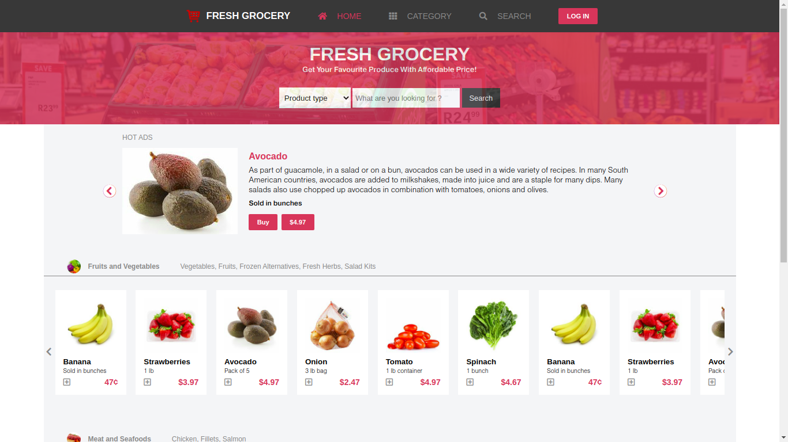

# Fresh Grocery | Online Grocery Shop

> Online Grocerry Shop website

This project is the final capstone project for the HTML/CSS curriculum at Microverse made based on the design template made by [Mohammed Awad](https://www.behance.net/gallery/24796463/ZATTIX)

## Project Description

The project consists of the following components:
- Two webpages (main and search-result)
- breakpoints at two screen width:
    * less than 768px(mobile screen)
    * greater than 768px(desktop screen)
- Header section that locks into fixed position when scrolling
- Banner section that only displays on desktop screen
- main page
    * list of grocery items with flex display (mobile screen)
    * list of grocery items on carousel with navigation button (desktop screen)
- search-result page
    * grid display with article and aside filter section stretching to 3/4 and 1/4 of the container width respectively
    * search result with flex column display
    * aside filter section that only displays on desktop screen
- Footer section layout made with flex

## Built With

- HTML5
- CSS3
- Sass
- JavaScript

## Live Demo

[Live Demo Link](https://freshgrocerry.netlify.app/)

## Authors

👤 **Binyam Hailemeskel**

- GitHub: [@bini-i](https://github.com/bini-i)
- Twitter: [@binyamshewa](https://twitter.com/binyamshewa)
- LinkedIn: [LinkedIn](https://www.linkedin.com/in/binyam-hailemeskel-728048151/)

## 🤝 Contributing

Contributions, issues, and feature requests are welcome!

## Show your support

Give a ⭐️ if you like this project!

## Acknowledgments

- This project is the final capstone project for the HTML/CSS curriculum at Microverse made based on the design template made by [Mohammed Awad](https://www.behance.net/gallery/24796463/ZATTIX)

## 📝 License

This project is [MIT](./LICENSE) licensed.
